 

# itsjose4

---

## main

<table>
<tr>
<td width="50%">

### lua

Roblox Lua, hub systems, toggles, remotes, tools, and UI logic.

</td>
<td width="50%">

### ftap

Fling Things and People scripts, Verbal Hub features, toy systems, blobman tools, ragdoll tools, and protection features.

</td>
</tr>
<tr>
<td width="50%">

### verbal hub ui

Verbal Hub UI, previews, tabs, sliders, buttons, mobile layouts, and script menus.

</td>
<td width="50%">

### xlqp

XLQP is coming out soon.

</td>
</tr>
</table>

---

## projects

| project | status | link |
|---|---|---|
| **Verbal Hub UI Previews** | active | [open](https://github.com/josediaz765/verbal-hub-uipreviews) |
| **Verbal Hub Bot Fansigns** | active | [open](https://github.com/josediaz765/verbal-hub-bot-fansigns-) |
| **XLQP Dances** | coming soon | [open](https://github.com/josediaz765/XLQP-dances) |
| **Hi** | extra | [open](https://github.com/josediaz765/Hi) |

---

## stack

---

## scriptblox

 

## xlqp

 

**XLQP is coming out soon.**

